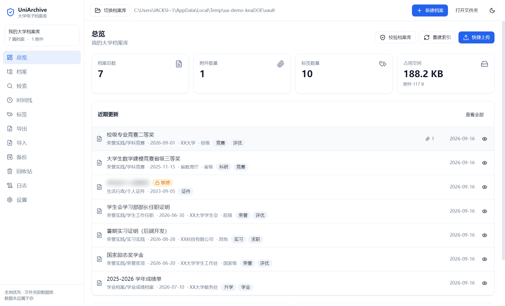
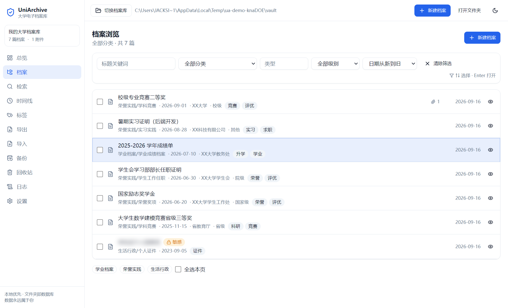
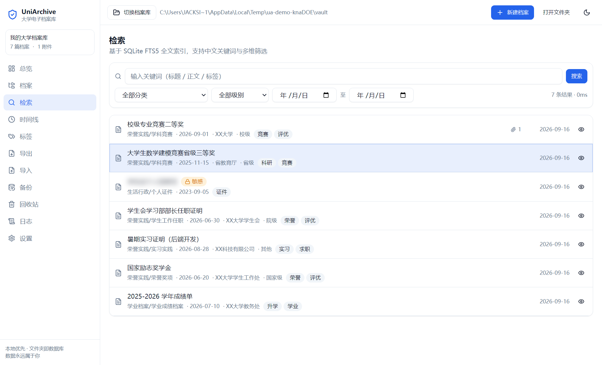
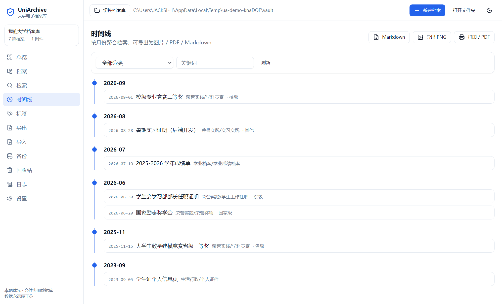
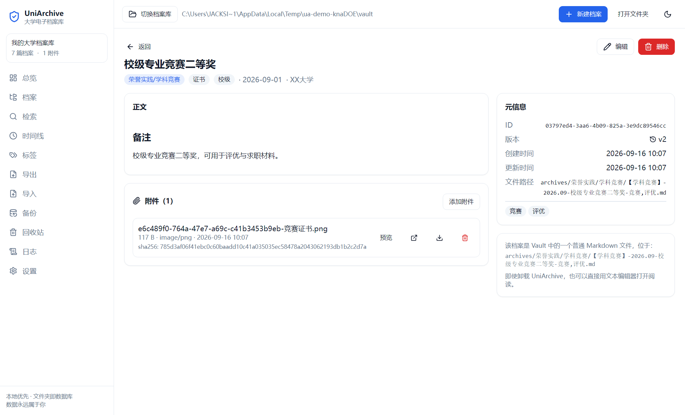
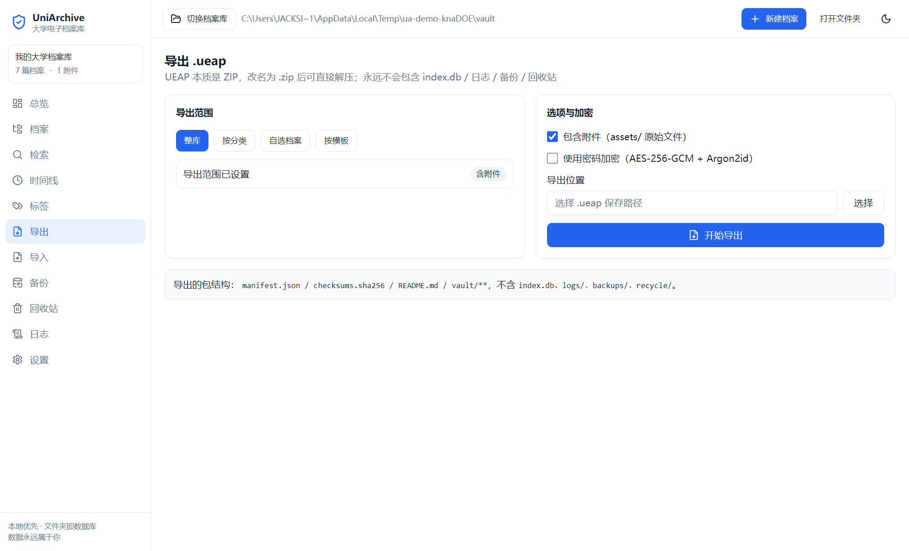
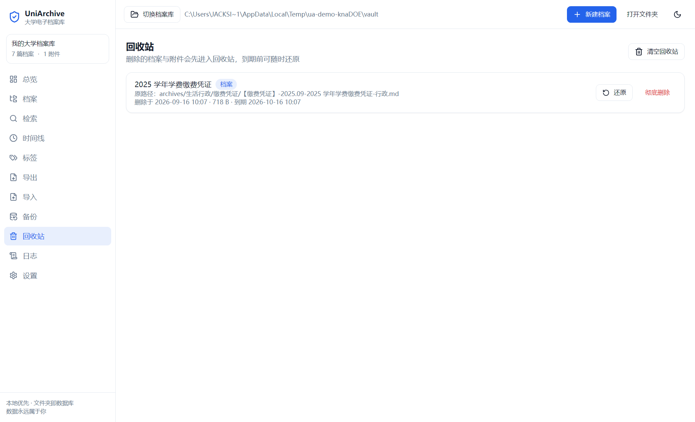
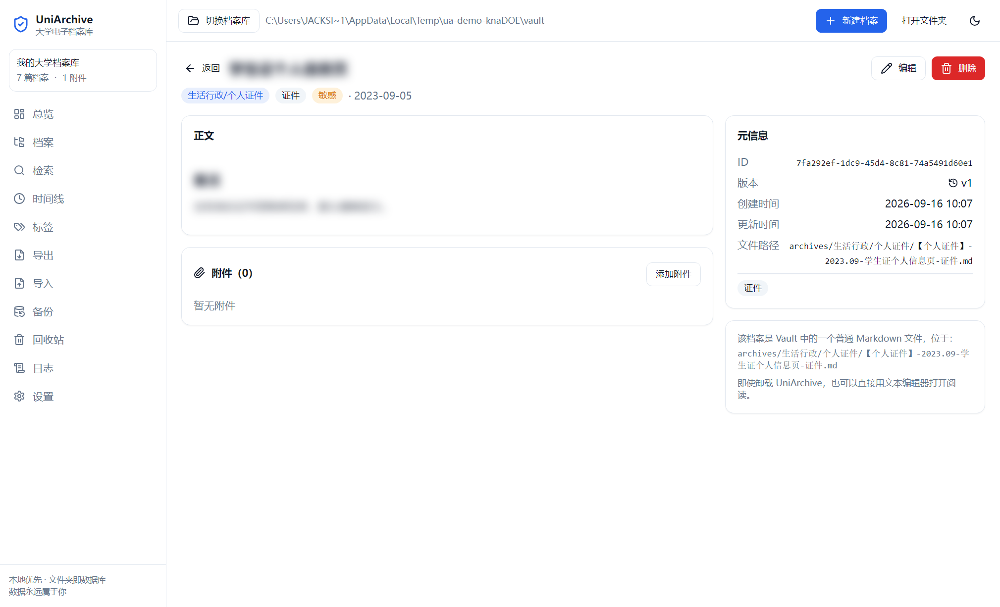
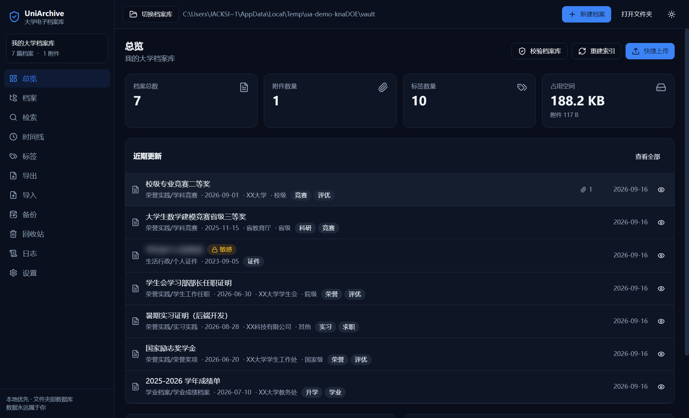

# UniArchive 大学档案库

> 开源 · 本地优先 · Obsidian 式大学生电子档案库

[](./LICENSE)
[](https://github.com/JACKSIDSON/UniArchive/releases/latest)
[](https://www.electronjs.org/)
[](#)
[](#)
[](#测试)

一句话：**文件夹即数据库**。所有档案都是普通 Markdown 文件（YAML frontmatter + 正文），附件是普通文件，
检索索引（SQLite FTS5）是可随时删除重建的派生数据。卸载软件后，你依然可以用任意文本编辑器读完整个大学。



---

## 特性

| 能力 | 说明 |
| --- | --- |
| 🗂 分类归档 | 17 个预设分类（学业 / 荣誉实践 / 生活行政），目录即分类 |
| 🔍 全文检索 | SQLite FTS5，中文关键词可用，10 万条档案检索 < 0.5s |
| 📎 附件管理 | 自动按 `assets/YYYY/MM/` 归档，sha256 去重，删除进回收站 |
| 🏷 标签系统 | `tags.json` 与索引双向同步，删除标签自动解除关联 |
| 📦 一键导出 | `.ueap` 包（本质是 ZIP，改名即可解压），支持 AES-256-GCM 加密 |
| 📥 一键导入 | 五种模式（新建 / 合并 / 覆盖 / 仅新增 / 预览），冲突五策略，导入前自动快照 |
| ♻️ 回收站 | 删除 30 天内可恢复，附件随档案一起保留 |
| 🗃 备份恢复 | 备份同样是 `.ueap`，恢复前自动生成快照，可反复回滚 |
| 📜 操作日志 | 所有写操作落盘为 JSONL + SQLite，可导出 JSON |
| 🌓 明暗主题 | 敏感档案默认模糊显示，点击才展开 |
| 🔌 插件骨架 | 从 `.uniarchive/plugins/` 加载，可注册命令 / 菜单 / 视图 |

---

## 下载安装

不想自己编译的话，直接下现成的：

| 平台 | 文件 | 说明 |
| --- | --- | --- |
| Windows 10/11 x64 | `UniArchive-1.0.0-Setup.exe` | 安装包，双击安装 |
| Windows 10/11 x64 | `UniArchive-1.0.0-Setup.zip` | 免安装版，解压后直接运行 `UniArchive.exe` |

👉 **[前往 Releases 下载](https://github.com/JACKSIDSON/UniArchive/releases/latest)**（含 SHA256 校验和）

> 安装包未做代码签名，Windows SmartScreen 首次运行可能提示"未知发布者"，选「仍要运行」即可。
> macOS / Linux 用户请从源码构建（见下）。

---

## 快速开始

```bash
# 1. 安装依赖（需要 Node 18+，包管理器为 pnpm）
pnpm install

# 2. 把原生模块切到 Electron ABI（首次必须，理由见 docs/dev-notes.md）
pnpm abi:electron

# 3. 启动开发模式
pnpm dev
```

首次启动会进入 Welcome 页面，选择「新建档案库」并指定一个空文件夹即可。

> **npm 用户**：把所有 `pnpm xxx` 换成 `npm run xxx` 同样可用；本环境曾在无法创建
> 符号链接的 Windows 上用 npm 完成过完整构建与打包，`.npmrc` 已预设 `node-linker=hoisted`
> 以兼容 Electron 与原生模块。

> **注意**：`better-sqlite3` 的 `.node` 与运行时 ABI 强绑定（Node 22 = 127，
> Electron 30 = 123），一份产物不可能两者通吃。本项目在 `.abi/` 里缓存了两份，
> 由 `scripts/use-abi.mjs` 按任务切换，`pnpm test` / `pnpm dist` 已自动处理。
> 手动切错时会报 `NODE_MODULE_VERSION` 不匹配，跑一次 `pnpm abi:electron` 即可。
>
> `.abi/` 不入库，首次需要按 `docs/dev-notes.md` 的手册下载两份预编译产物。

---

## 常用命令

| 命令 | 说明 |
| --- | --- |
| `pnpm dev` | 启动 Electron 开发模式（热更新） |
| `pnpm build` | 类型检查并产出 `out/` |
| `pnpm typecheck` | 仅类型检查 |
| `pnpm test` | 运行 Vitest 单元测试（自动切 ABI） |
| `pnpm test:e2e` | Playwright 直驱真实 Electron 应用 |
| `pnpm bench:search` | 10 万条档案检索性能基准 |
| `pnpm dist` | 打包 Windows 安装包 |
| `pnpm dist:mac` | 打包 macOS dmg |
| `node scripts/demo-capture.mjs` | 自动灌演示数据并逐页截图到 `screenshots/` |
| `pnpm abi:node` / `pnpm abi:electron` | 手动切换原生模块 ABI |

---

## 测试

| 层次 | 工具 | 规模 | 结果 |
| --- | --- | --- | --- |
| 类型检查 | `tsc --noEmit` | — | 0 错 |
| 单元测试 | Vitest | 67 项 / 7 个文件 | 全过 |
| 端到端 | Playwright（直驱真实 Electron） | 7 个场景 | 全过 |
| 性能基准 | Vitest（真实生成 10 万篇 Markdown） | 4 项断言 | 全过（检索均 ≤ 0.5s） |

```bash
pnpm typecheck     # 类型检查
pnpm test          # 单元测试（自动切到 Node ABI，跑完自动切回 Electron）
pnpm test:e2e      # 端到端：启动真实应用并驱动完整流程
pnpm bench:search  # 10 万条检索性能基准（约 19 分钟，绝大部分耗在写 10 万个文件）
```

E2E 覆盖四个核心场景：新建 Vault → 归档 → 检索 → 导出 `.ueap`；跨 Vault 导入合并；
删除进入回收站再恢复；加密导出的正确密码成功 / 错误密码失败。
并直接断言数据不变量（`.ueap` 改名 `.zip` 可解压、不携带 `index.db`/`logs`/`backups`/`recycle`、
导入前自动快照、回收站 30 天 TTL）。

---

## 界面预览

以下截图全部由 `scripts/demo-capture.mjs` 驱动**打包后的真实应用**自动生成（含演示数据），
不是设计稿，也不是手绘原型。

| 分类浏览 | 全文检索 |
| --- | --- |
|  |  |

| 成长时间线 | 档案详情（含附件） |
| --- | --- |
|  |  |

| 导出中心 | 回收站（30 天可恢复） |
| --- | --- |
|  |  |

| 敏感档案默认模糊 | 暗黑模式 |
| --- | --- |
|  |  |

其余截图见 [`screenshots/`](./screenshots)：Welcome、标签、导入、备份、日志、设置。

---

## 技术栈

- 桌面容器：Electron 30
- 构建：Vite 5 + electron-vite
- 前端：React 18 + TypeScript 5 + Tailwind CSS 3 + shadcn 风格组件
- 状态：Zustand；路由：React Router 6（HashRouter）
- 数据：better-sqlite3（FTS5）、gray-matter + js-yaml、adm-zip、Node crypto（AES-256-GCM）+ Argon2id
- 测试：Vitest + Playwright

不引入任何云端 SDK，不引入 Redux / Prisma / NestJS / Next.js 等重型依赖。

---

## Vault 目录结构

```
<vault>/
├── vault.json              # 档案库元信息
├── README.md
├── archives/               # 档案正文：Markdown + YAML frontmatter
│   └── <一级分类>/<二级分类>/【分类】-时间-名称-标签.md
├── assets/                 # 附件原始文件
│   └── <YYYY>/<MM>/<uuid>-<原文件名>
└── .uniarchive/
    ├── config.json         # Vault 级配置
    ├── index.db            # 检索索引（可删除重建）
    ├── tags.json
    ├── templates/
    ├── plugins/
    ├── themes/
    ├── backups/
    ├── logs/
    └── recycle/
```

完整格式规范见 [`docs/format.md`](./docs/format.md)，插件开发见 [`docs/plugin-api.md`](./docs/plugin-api.md)。

---

## 数据不变量

任何情况下都不会被违反：

1. 删除 `index.db` 后档案库仍完整可用，索引可一键重建。
2. 卸载软件后，用户可直接用文本编辑器阅读所有档案。
3. 所有档案都有唯一 UUID v4。
4. 所有附件路径相对 Vault 根目录。
5. `.ueap` 改名为 `.zip` 后可直接解压。
6. UEAP 包中永不包含 `index.db` / `logs/` / `backups/` / `recycle/`。
7. 任何覆盖用户文件的操作都会先生成备份快照。

---

## 许可

MIT License，详见 [LICENSE](./LICENSE)。
